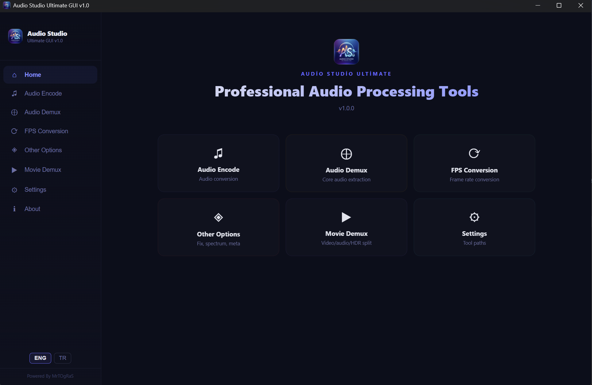
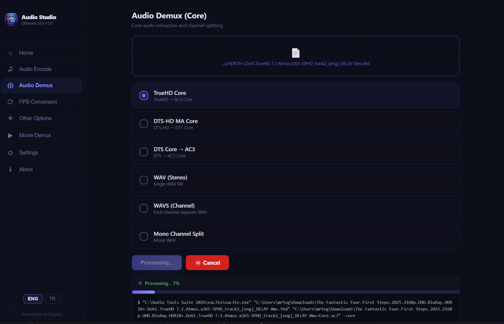

<div align="center">

# 🎛️ Audio Studio Ultimate GUI

**Professional Audio Processing Toolkit**

[](https://www.electronjs.org/)
[](https://reactjs.org/)
[](LICENSE)
[](https://www.microsoft.com/windows)

<br />

<!-- Screenshot placeholder - add your screenshot here -->
<!--  -->

---

### 🌐 Select Language / Dil Seçin

[🇬🇧 English](#-english) &nbsp;|&nbsp; [🇹🇷 Türkçe](#-türkçe)

---

</div>

<a name="english"></a>

## 🇬🇧 English

### 📖 About

**Audio Studio Ultimate GUI** is an all-in-one desktop application that brings together the most powerful command-line audio tools under a single, modern graphical interface. Encode lossless Atmos tracks, extract HDR metadata, demux Blu-ray discs, convert frame rates, fix audio streams — all from one clean, intuitive window.

Built on **Electron 41** and **React 19**, it provides a responsive, native-feeling experience on Windows while orchestrating industry-standard engines (DEEW, DeeZy, eac3to, FFmpeg) behind the scenes.


---

### ✨ Features

| Category | Details |
|---|---|
| 🔊 **Audio Encode** | TrueHD, DTS-HD, DTS, AC3, E-AC3, AC-4, WAV, FLAC, AAC, MP3, MP2, Opus — with selectable bitrate, channels & engine |
| 🔀 **Audio Demux** | TrueHD / DTS-HD / DTS core extraction, stereo downmix, per-channel WAV splitting (5.1 → L, R, C, LFE, Ls, Rs) |
| 🎞️ **FPS Conversion** | 23.976 ↔ 24.000 ↔ 25.000 lossless & lossy frame rate conversion with automatic bitrate detection |
| 🎬 **Movie Demux** | Track-level extraction via MKVToolNix, eac3to or DGDemux — video, audio, subtitles & chapters |
| 💿 **DVD / VCD Demux & Merge** | Full DVD VOB demuxing, multi-CD VCD extraction with optional merge and format conversion |
| 🌈 **HDR Data Demux** | Dolby Vision RPU extraction (`dovi_tool`) and HDR10+ JSON metadata extraction (`hdr10plus_tool`) |
| 🔉 **Volume Booster** | Light / Medium / Strong / Custom presets with dynamic normalization and compression |
| 🛠️ **Audio Fix** | "Track Not Clean" fix, CRC mismatch repair, noise removal (hiss/crackle cleaning) |
| 🌐 **E-AC-3 JOC Atmos Fix** | Channel map + CRC correction for E-AC-3 JOC (Dolby Atmos) 7.1 bitstreams |
| 📊 **Spectrum Analysis** | Generate visual spectrum images from any audio file |
| 🏷️ **TrueHD Metadata** | Decode and export TrueHD presentation metadata via `truehdd` |
| ℹ️ **MediaInfo** | Instant detailed codec, bitrate, channel, dialnorm and FPS information |
| ⚙️ **Multi-Engine** | Automatic or manual engine selection: DEEW, DeeZy, eac3to, FFmpeg |
| 🌐 **Bilingual UI** | Full English / Turkish interface with one-click language switching |

---

### 📸 Screenshots

<p align="center">
  
  &nbsp;&nbsp;
  
</p>


---

### 🧰 Required Tools

> ⚠️ **Important:** The tools below are **NOT** included with Audio Studio Ultimate GUI. Download each one separately. Place them in your system `PATH` or configure paths in the app's **Settings** panel.
>
> **Default tool directory:** `C:\Audio Tools Suite 2026\`

| Tool | Download | License |
|---|---|---|
| **FFmpeg** *(includes FFprobe)* | [GitHub Releases](https://github.com/BtbN/FFmpeg-Builds/releases) | GPL / LGPL |
| **eac3to** | [RationalQM](https://www.rationalqm.us/eac3to/) | Freeware |
| **QAAC** | [GitHub Releases](https://github.com/nu774/qaac/releases) | Public Domain |
| **MKVToolNix** *(mkvextract, mkvmerge)* | [Official Downloads](https://mkvtoolnix.download/downloads.html) | GPL v2 |
| **DEEW** | [GitHub](https://github.com/pcroland/deew) | GPL v3 |
| **DeeZy** | [GitHub](https://github.com/Draz1l/DeeZy) | GPL v3 |
| **DGDemux** | [Official Site](https://www.rationalqm.us/dgdemux/dgdemux.html) | Freeware |
| **MediaInfo** | [Official Downloads](https://mediaarea.net/en/MediaInfo/Download) | BSD |
| **dovi_tool** | [GitHub Releases](https://github.com/quietvoid/dovi_tool/releases) | MIT |
| **hdr10plus_tool** | [GitHub Releases](https://github.com/quietvoid/hdr10plus_tool/releases) | MIT |
| **tsMuxeR** | [GitHub Releases](https://github.com/justdan96/tsMuxer/releases) | Apache 2.0 |
| **truehdd** | [GitHub Releases](https://github.com/truehdd/truehdd) | Apache 2.0 |
| **Apple CoreAudioToolbox** | Install [iTunes](https://www.apple.com/itunes/) or Apple Application Support | Apple EULA |
| **Dolby Encoding Engine (Buy)** | [Dolby Professional Support](https://professionalsupport.dolby.com/s/topic/0TO4u000000ey3AGAQ/dolby-encoding-engine-dee?language=en_US) | 💰 Commercial |

> **📌 Dolby Encoding Engine (DEE) Path:**
> ```
> C:\Audio Tools Suite 2026\dee\dee.exe
> ```
> If DEE does not work, make sure the path is correctly set in the app's **Settings** panel. DEE requires a valid **Dolby license** — without it, encoding will fail. As a free alternative, the app will automatically fall back to **DEEW** or **FFmpeg** for supported formats.

---

### 💻 Installation

**Prerequisites:**
- Windows 10 / 11
- [Node.js](https://nodejs.org/) (LTS recommended)

```bash
git clone https://github.com/MrTOgRaS/audio-studio.git
cd audio-studio
npm install
```

### 🏗️ Building

```bash
npm run build        # Build React app
npm run dist         # Build Electron installer + portable
```

| Output | Path |
|---|---|
| 📦 Portable | `release/win-unpacked/` |
| 💿 Installer | `release/Audio Studio Ultimate Setup 1.0.0.exe` |

---

### 📄 License

```
MIT License

Copyright (c) 2026 Murat Oğraş

Permission is hereby granted, free of charge, to any person obtaining a copy
of this software and associated documentation files (the "Software"), to deal
in the Software without restriction, including without limitation the rights
to use, copy, modify, merge, publish, distribute, sublicense, and/or sell
copies of the Software, and to permit persons to whom the Software is
furnished to do so, subject to the following conditions:

The above copyright notice and this permission notice shall be included in all
copies or substantial portions of the Software.

THE SOFTWARE IS PROVIDED "AS IS", WITHOUT WARRANTY OF ANY KIND, EXPRESS OR
IMPLIED, INCLUDING BUT NOT LIMITED TO THE WARRANTIES OF MERCHANTABILITY,
FITNESS FOR A PARTICULAR PURPOSE AND NONINFRINGEMENT. IN NO EVENT SHALL THE
AUTHORS OR COPYRIGHT HOLDERS BE LIABLE FOR ANY CLAIM, DAMAGES OR OTHER
LIABILITY, WHETHER IN AN ACTION OF CONTRACT, TORT OR OTHERWISE, ARISING FROM,
OUT OF OR IN CONNECTION WITH THE SOFTWARE OR THE USE OR OTHER DEALINGS IN THE
SOFTWARE.
```
<div align="center">

[](https://www.buymeacoffee.com/MrTOgRaS)

</div>
---

<a name="türkçe"></a>

## 🇹🇷 Türkçe

### 📖 Hakkında

**Audio Studio Ultimate GUI**, en güçlü komut satırı ses araçlarını tek bir modern grafik arayüz altında birleştiren hepsi bir arada masaüstü uygulamasıdır. Kayıpsız Atmos parçaları kodlayın, HDR meta verilerini çıkarın, Blu-ray diskleri demux edin, kare hızlarını dönüştürün, ses akışlarını onarın — hepsi temiz ve sezgisel tek bir pencereden.

**Electron 41** ve **React 19** üzerine inşa edilmiş olup, DEEW, DeeZy, eac3to ve FFmpeg gibi endüstri standardı motorları arka planda yönetirken Windows üzerinde hızlı ve doğal bir deneyim sunar.

---

### ✨ Özellikler

| Kategori | Detaylar |
|---|---|
| 🔊 **Ses Kodlama** | TrueHD, DTS-HD, DTS, AC3, E-AC3, AC-4, WAV, FLAC, AAC, MP3, MP2, Opus — bitrate, kanal ve motor seçimiyle |
| 🔀 **Ses Demux** | TrueHD / DTS-HD / DTS çekirdek çıkarma, stereo downmix, kanal bazlı WAV ayırma (5.1 → L, R, C, LFE, Ls, Rs) |
| 🎞️ **FPS Dönüştürme** | 23.976 ↔ 24.000 ↔ 25.000 kayıpsız ve kayıplı kare hızı dönüşümü, otomatik bitrate algılama |
| 🎬 **Film Demux** | MKVToolNix, eac3to veya DGDemux ile parça düzeyinde çıkarma — video, ses, altyazı ve bölümler |
| 💿 **DVD / VCD Demux ve Birleştirme** | Tam DVD VOB demux, çoklu CD VCD çıkarma, isteğe bağlı birleştirme ve format dönüşümü |
| 🌈 **HDR Veri Demux** | Dolby Vision RPU çıkarma (`dovi_tool`) ve HDR10+ JSON meta veri çıkarma (`hdr10plus_tool`) |
| 🔉 **Ses Yükseltici** | Hafif / Orta / Güçlü / Özel ön ayarlar, dinamik normalizasyon ve sıkıştırma |
| 🛠️ **Ses Onarım** | "Track Not Clean" düzeltme, CRC uyumsuzluğu tamiri, gürültü temizleme (cızırtı/parazit) |
| 🌐 **E-AC-3 JOC Atmos Fix** | E-AC-3 JOC (Dolby Atmos) 7.1 bitstream'ler için kanal haritası + CRC düzeltmesi |
| 📊 **Spektrum Analizi** | Herhangi bir ses dosyasından görsel spektrum görüntüsü oluşturma |
| 🏷️ **TrueHD Meta Veri** | `truehdd` ile TrueHD presentation meta verilerini çözme ve dışa aktarma |
| ℹ️ **MediaInfo** | Anlık detaylı codec, bitrate, kanal, dialnorm ve FPS bilgisi |
| ⚙️ **Çoklu Motor** | Otomatik veya manuel motor seçimi: DEEW, DeeZy, eac3to, FFmpeg |
| 🌐 **İki Dilli Arayüz** | Tek tıkla İngilizce / Türkçe arayüz değiştirme |

---

### 🧰 Gerekli Araçlar

> ⚠️ **Önemli:** Aşağıdaki araçlar uygulama ile birlikte **gelmemektedir**. Her birini ayrı ayrı indirmeniz gerekmektedir. Araçları sistem `PATH`'inize ekleyin veya uygulama içindeki **Ayarlar** panelinden yollarını yapılandırın.
>
> **Varsayılan araç dizini:** `C:\Audio Tools Suite 2026\`

| Araç | İndirme | Lisans |
|---|---|---|
| **FFmpeg** *(FFprobe dahil)* | [GitHub Releases](https://github.com/BtbN/FFmpeg-Builds/releases) | GPL / LGPL |
| **eac3to** | [RationalQM](https://www.rationalqm.us/eac3to/) | Ücretsiz |
| **QAAC** | [GitHub Releases](https://github.com/nu774/qaac/releases) | Public Domain |
| **MKVToolNix** *(mkvextract, mkvmerge)* | [Resmi İndirmeler](https://mkvtoolnix.download/downloads.html) | GPL v2 |
| **DEEW** | [GitHub](https://github.com/pcroland/deew) | GPL v3 |
| **DeeZy** | [GitHub](https://github.com/Draz1l/DeeZy) | GPL v3 |
| **DGDemux** | [Resmi Site](https://www.rationalqm.us/dgdemux/dgdemux.html) | Ücretsiz |
| **MediaInfo** | [Resmi İndirmeler](https://mediaarea.net/en/MediaInfo/Download) | BSD |
| **dovi_tool** | [GitHub Releases](https://github.com/quietvoid/dovi_tool/releases) | MIT |
| **hdr10plus_tool** | [GitHub Releases](https://github.com/quietvoid/hdr10plus_tool/releases) | MIT |
| **tsMuxeR** | [GitHub Releases](https://github.com/justdan96/tsMuxer/releases) | Apache 2.0 |
| **truehdd** | [GitHub Releases](https://github.com/truehdd/truehdd) | Apache 2.0 |
| **Apple CoreAudioToolbox** | [iTunes](https://www.apple.com/itunes/) veya Apple Application Support yükleyin | Apple EULA |
| **Dolby Encoding Engine (Satın Al)** | [Dolby Professional Support](https://professionalsupport.dolby.com/s/topic/0TO4u000000ey3AGAQ/dolby-encoding-engine-dee?language=en_US) | 💰 Ticari |

> **📌 Dolby Encoding Engine (DEE) Yolu:**
> ```
> C:\Audio Tools Suite 2026\dee\dee.exe
> ```
> DEE çalışmıyorsa, uygulamanın **Ayarlar** panelinden yolun doğru ayarlandığından emin olun. DEE geçerli bir **Dolby lisansı** gerektirir — lisans olmadan kodlama başarısız olur. Ücretsiz alternatif olarak, uygulama desteklenen formatlar için otomatik olarak **DEEW** veya **FFmpeg**'e geçiş yapar.

---

### 💻 Kurulum

**Ön Koşullar:**
- Windows 10 / 11
- [Node.js](https://nodejs.org/) (LTS önerilir)

```bash
git clone https://github.com/MrTOgRaS/audio-studio.git
cd audio-studio
npm install
```

### 🏗️ Derleme

```bash
npm run build        # React uygulamasını derle
npm run dist         # Electron yükleyici + taşınabilir sürüm oluştur
```

| Çıktı | Yol |
|---|---|
| 📦 Taşınabilir | `release/win-unpacked/` |
| 💿 Yükleyici | `release/Audio Studio Ultimate Setup 1.0.0.exe` |

---

### 📄 Lisans

```
MIT License — Copyright (c) 2026 Murat Oğraş
```

Tam lisans metni için [LICENSE](LICENSE) dosyasına bakın.

---

<div align="center">

[](https://www.buymeacoffee.com/MrTOgRaS)


**Powered By MrTOgRaS**

</div>
